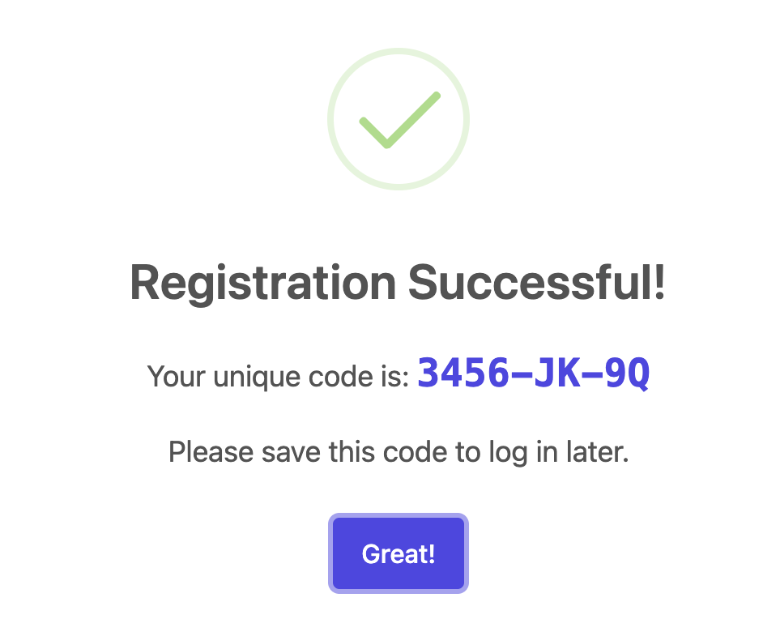

we need a page to walk through the whole process 
https://eegc.hkbu.me/aiedit 
students should first register (if they are new) 

then they go through this process 

I was not able the register because the supabase database was paused 
nobody is aware of that!  

3456-JK-9Q this unique code - student has to remember- take a screenshot

teacher may help the student retrieve through their dashboard 

